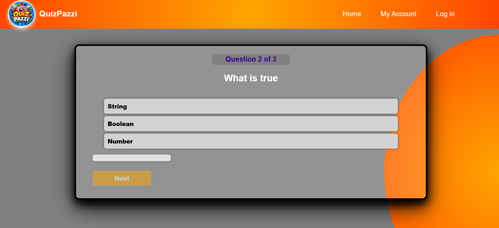

# Quiz App 

A simple and interactive Quiz Application built using HTML, CSS, and JavaScript.

## Features
- Multiple choice questions
- Score calculation
- Next question functionality
- Restart quiz option

## Technologies Used
- HTML
- CSS
- JavaScript

## Screenshot

## 🔗 Live Demo
(Add GitHub Pages link here)

## 💡 What I learned
- DOM manipulation
- Event handling
- Working with arrays and objects in JavaScript