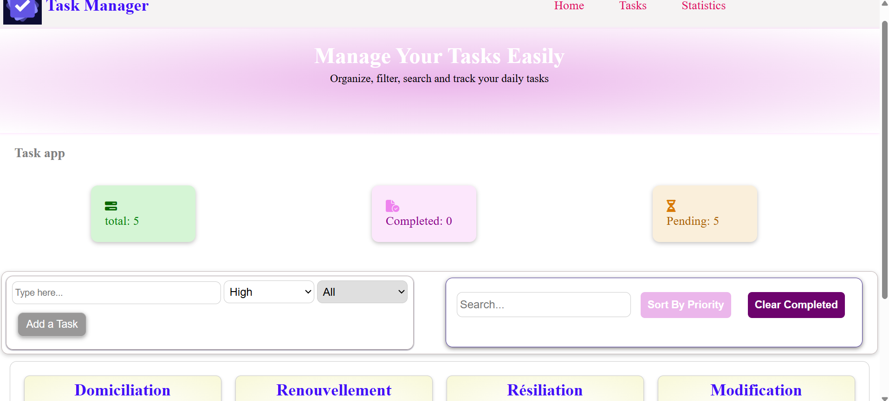

# Task Manager App 🚀

A responsive Task Management application built with HTML, CSS and JavaScript.

## Features

- Add new tasks
- Edit tasks
- Delete tasks
- Mark tasks as completed
- Search tasks
- Filter tasks by priority
- Sort tasks by priority
- Clear completed tasks
- Task statistics
- Data persistence using LocalStorage

## Technologies

- HTML5
- CSS3
- JavaScript
- LocalStorage

## Screenshot

## Demo

Live Demo:
-https://wijdane-09.github.io/My-Own-Projects/task-manager-app/

## What I learned

- DOM manipulation
- Working with arrays methods (filter, sort)
- LocalStorage
- Event handling
- Dynamic UI rendering