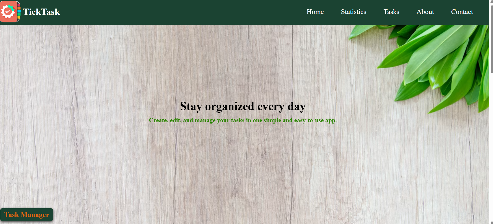

# TickTask

TickTask is a simple and user-friendly task management application built with HTML, CSS, and JavaScript.

## 🚀 Features

- Add tasks
- Edit tasks
- Delete tasks
- Mark tasks as completed
- Search tasks
- Filter tasks by priority
- Sort tasks by priority
- Clear completed tasks
- Task statistics
- Data persistence with LocalStorage
- Responsive design

## 🛠️ Technologies

- HTML5
- CSS3
- JavaScript
- LocalStorage
- Font Awesome

## 📸 Screenshot

## 🌐 Live Demo

[View Live Demo](https://wijdane-09.github.io/My-Own-Projects/tick-task/)

## 🎯 Purpose

This project was created to practice JavaScript, DOM manipulation, events, array methods, and LocalStorage while building a practical frontend application.

## 👩‍💻 Author

Wijdane ES-SAFI
